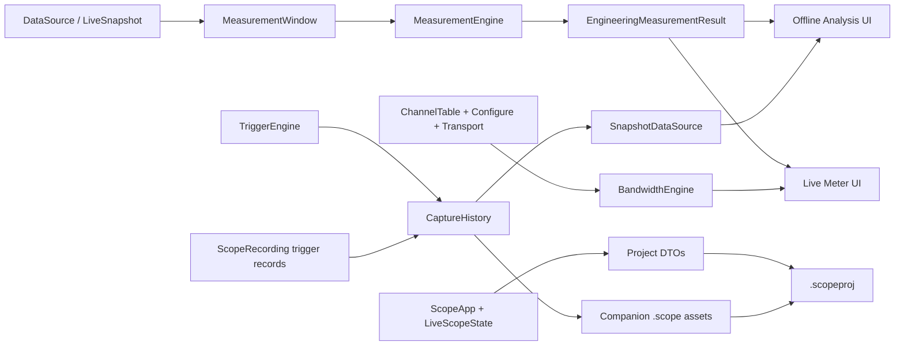

# Scope Analyzer 0.11.0 P0 Technical Design

## 1. Purpose and Boundaries

0.11.0 closes four single-device daily-debugging loops without changing device firmware contracts:

1. Consistent engineering measurements in Offline, frozen Capture, and Live.
2. More than one retained and navigable trigger Capture.
3. A complete, versioned, recoverable application project.
4. Acquisition link-budget guidance before configuration is sent.

The release preserves SCP1 V1 and the `.scope` V1 file format. It introduces one new user-facing application format, `.scopeproj`, and may create ordinary `.scope` companion assets for in-memory Captures.

## 2. Architecture Overview



Pure domain services live in the library crate. The desktop application owns UI composition, async worker lifecycle, file dialogs, recovery prompts, and atomic workspace replacement.

## 3. Shared Identity Model

### 3.1 Why IDs are required

Current state frequently relies on vector positions. A project cannot safely restore by position when files change, channels are reordered, or an imported dataset is missing. 0.11.0 introduces serialized references without rewriting every runtime vector.

### 3.2 Types

- `ProjectId(String)`: generated from timestamp + process-local counter; no external UUID dependency required.
- `SourceId(String)`: stable inside one project.
- `CaptureId(String)`: `live-{session_generation}-{ordinal}` or `recording-{source_id}-{trigger_ordinal}`.
- `ProjectChannelRef { source_id, raw_name, index_hint, channel_id_hint }`.

Channel restore resolution order:

1. Unique source-specific channel ID when the source exposes one.
2. Unique exact raw name.
3. Index hint with a warning.
4. Unresolved; keep the reference disabled and report it.

Display names are never used as identity.

## 4. Unified Engineering Measurements

### 4.1 Module boundary

Add library module `src/measurements.rs`:

- `MeasurementWindow`: one or more gap-separated `SampleBlock`s plus sample-rate metadata.
- `ChannelMeasurementRequest`: channel index/reference, scale, unit, and frequency hint.
- `ThreePhasePowerRequest`: Va/Vb/Vc and Ia/Ib/Ic bindings, gains, units, and sign convention.
- `ChannelStatistics`: valid count, duration, mean, RMS, min, max, positive peak, negative peak, absolute peak, peak-to-peak, estimated frequency, and quality flags.
- `ThreePhasePower`: active power P, fundamental reactive power Q, effective apparent power S, true PF, estimated frequency, and quality flags.
- `EngineeringMeasurementResult`: request identity, time range, per-channel rows, optional power result, and aggregate quality.

The engine accepts already decoded samples and never reads files or UI state itself.

### 4.2 Window semantics

- Offline/frozen analysis: X1–X2 interval, preserving DataSource segments.
- Live: latest complete measurement window, default 10 nominal cycles, clamped to 0.1–2.0 s.
- Statistics aggregate finite samples across segments.
- Frequency and three-phase calculations never bridge a gap.
- A result containing gaps is valid only when at least one individual segment meets the algorithm’s minimum duration; it carries `ContainsGap`.
- A stale Live result displays its timestamp/age and is never silently treated as current.

### 4.3 Single-channel formulas

For finite samples `x`:

- `mean = Σx/N`
- `rms = sqrt(Σx²/N)` (true RMS including DC)
- `min`, `max`
- `positive_peak = max`
- `negative_peak = min`
- `absolute_peak = max(|min|, |max|)`
- `peak_to_peak = max - min`

Existing Y1/Y2/dY remain cursor-interpolated values. They are displayed alongside the new window statistics.

### 4.4 Actual frequency estimation

Recommended 0.11 algorithm:

1. Remove finite-sample mean.
2. Set crossing hysteresis to `max(5% of peak-to-peak, numerical floor)`.
3. Find rising crossings with a low/high latch and linear timestamp interpolation.
4. Require at least three complete periods in one segment.
5. Compute periods, take their median, reject periods outside ±20% of the median, then recompute the median.
6. Return `1/median_period` plus a quality flag; return Invalid for low amplitude, insufficient cycles, non-monotonic time, or excessive jitter.

This is preferred over using cursor `1/dX` and is cheaper than running a PLL for every channel. The harmonic-base setting is only an optional plausibility hint, not the returned value.

### 4.5 Three-phase power definitions

The UI requires explicit voltage A/B/C and current A/B/C bindings. Values use configured measurement gains; default gains are the existing channel scale so displayed measurements remain backward-compatible.

- `P`: average of `va·ia + vb·ib + vc·ic` over aligned finite samples.
- `Q`: fundamental three-phase reactive power from voltage/current phasors evaluated at the estimated or nominal frequency; positive means current lags voltage.
- `S`: effective apparent power `sqrt(ΣVrms_phase² × ΣIrms_phase²)`, which remains meaningful under imbalance and distortion.
- `PF`: `P/S`, clamped only for numerical tolerance; Invalid when S is near zero.

The UI labels Q as fundamental reactive power in help text. A later release may add displacement PF and harmonic decomposition; 0.11 does not hide this definition.

### 4.6 Units and scaling

- Single-channel statistics use the same scale currently applied to cursor measurements.
- Power configuration stores six per-binding engineering gains and optional unit overrides.
- When voltage/current units are recognized (V/kV and A/kA), results normalize to W/kW/MW/var/VA.
- Unknown/incompatible units show unitless engineering values and a visible warning; calculations still run.
- Changing plot color or pane never changes measurements. Changing channel scale/gain invalidates the measurement cache.

### 4.7 Async execution

- Offline keeps the existing cancel/restart worker model, replacing narrow `AutoMeasurement` rows with `EngineeringMeasurementResult`.
- Live uses one coalescing worker at 5 Hz default. If a job is running, only the newest pending request is retained.
- Live snapshots are bounded to the measurement window before worker dispatch.
- No measurement code runs on the acquisition/session/recording threads.

## 5. Capture Event History

### 5.1 Domain model

Add `src/live/capture_history.rs`:

- `CaptureHistory`
- `CaptureEntry`
- `CaptureId`
- `CaptureOrigin::{Live, Recording { source_id, trigger_ordinal }}`
- `CapturePayload::{InMemory(Arc<TriggerCapture>), RecordingRange(...)}`
- `CaptureQuality { auto_timeout, contains_gap, incomplete_pre, incomplete_post }`

Each entry stores trigger time/sample index, source channel, mode/edge/level, pre/post counts, display name, note, pinned flag, created time, approximate bytes, and payload/reference.

### 5.2 Bounds and eviction

Defaults:

- Maximum 100 entries.
- Maximum 128 MiB of in-memory Capture payloads.

Evict the oldest unpinned entries until both bounds are satisfied. If all entries are pinned and a new Capture would exceed the byte budget, retain recording-backed metadata when available; otherwise reject retention with an explicit warning while acquisition and recording continue. History limits become project settings, clamped to safe maxima.

### 5.3 Trigger engine output

Change the trigger feed boundary to return all completed Captures from one incoming batch, not only the first. Preserve a compatibility helper if it simplifies migration. Each Capture is recorded and inserted into history in order.

### 5.4 Live behavior

- `selected_capture_id` replaces implicit `last_capture` display ownership.
- Triggering selects the new event by default unless the user enabled “keep current selection.”
- Arm/Single rearm clears trigger working history but not Capture event history.
- Clear History requires confirmation when pinned entries exist.
- Analyze Capture uses the selected entry and the existing SnapshotDataSource route.

### 5.5 `.scope` replay behavior

`ScopeRecording::triggers()` already provides multiple trigger records. Add an adapter that derives each event’s requested `[trigger-pre, trigger+post]` sample range and quality from sample record indices/gaps. Recording-backed entries read lazily through `ScopeRecordingDataSource`; they do not duplicate samples in memory.

No `.scope` format change is required.

### 5.6 Persistent Capture assets

A `.scopeproj` references existing recording-backed events by source ID and trigger ordinal. In-memory Live Captures have no durable source, so the project service materializes them into valid companion `.scope` V1 files:

- Sibling directory: `<project-name>.scopeproj.assets/captures/`.
- F32 ChannelTable containing the captured channels and presentations.
- SampleBatch records split at protocol limits.
- Existing TriggerRecord written with original configuration.
- Content-addressed/stable filename by Capture ID and fingerprint; write once, reuse on autosave.

After the first explicit project save, newly retained Captures are materialized asynchronously. Untitled recovery uses an application recovery directory and relocates assets on Save As.

## 6. `.scopeproj` Project and Recovery

### 6.1 Chosen approach

Use explicit serializable DTOs and conversion/validation layers. Do not derive Serialize on `ScopeApp` or persist caches, textures, worker handles, open file objects, session sockets, transient errors, hover state, or undo stacks that have no durable meaning.

### 6.2 Schema envelope

```json
{
  "scopeProjectType": "scope-analyzer-project",
  "schemaVersion": 1,
  "createdByVersion": "0.11.0",
  "projectId": "...",
  "sources": [],
  "workspace": {},
  "analysis": {},
  "liveProfile": {},
  "captures": [],
  "export": {}
}
```

Recommended top-level DTOs:

- `ProjectSource`: ID, kind, relative path, absolute hint, file size, modified time, optional partial fingerprint.
- `ProjectDataset`: source ID, role/order, display name, visibility, line style, time offset, channel presentations keyed by `ProjectChannelRef`.
- `ProjectWorkspace`: layout, shared PlotViewport DTO, pane bounds, panel visibility/tabs, selected dataset/channel references.
- `ProjectAnalysis`: harmonic base, measurement profile/window, power bindings/gains, FFT/sequence/PLL/dq0 selections, derived curves and their presentation.
- `ProjectLiveProfile`: transport preset without credentials, acquisition config, history length, trigger config, Capture-history limits.
- `ProjectCaptureRef`: Capture ID, source/event reference, label/note/pinned/selection state.
- `ProjectExportState`: export presets, batch windows, normalized annotations, label overrides/anchors, cursor-table option.

### 6.3 Annotation persistence

Existing annotation coordinates are canvas pixels. Project DTOs store normalized `[0,1]` coordinates relative to the saved preview canvas plus original canvas size for migration. On load, coordinates are clamped and transformed to the current preview size. Runtime undo/redo history is not persisted; current annotations are.

### 6.4 Source identity and relocation

- Resolve relative path against the project directory first.
- Fall back to absolute hint.
- Compare size/mtime and optional partial CRC32C fingerprint of first/last 64 KiB.
- A fingerprint mismatch requires user confirmation; it never silently substitutes data.
- Missing files enter one relocation workflow that can map a directory and resolve multiple sources.
- Unresolved optional sources remain disabled; unresolved primary source prevents commit of the restore transaction.

### 6.5 Transactional loading

1. Parse with a 10 MiB project-file limit.
2. Validate type, schema, duplicate IDs, finite values, safe relative paths, bounds, and references.
3. Resolve/relocate source paths.
4. Open all sources asynchronously with cancellation.
5. Resolve channel references and produce warnings.
6. Build `RestoredWorkspace` without mutating the current app.
7. Cancel current workers only after staging succeeds.
8. Atomically replace durable state, bump data generation, and restart required plot/measurement jobs.

Any failure before step 7 leaves the current workspace untouched.

### 6.6 Saving and dirty state

- `project_generation` increments for durable project mutations.
- `last_saved_generation` tracks explicit save.
- Save JSON via temporary sibling file, flush/sync, then replace atomically.
- Existing names/display/dataset/shortcut config files remain supported as presets.
- Project Save As estimates companion Capture asset size before writing.

### 6.7 Autosave and crash recovery

- Debounced autosave after 2 seconds of inactivity, no more than once every 10 seconds.
- Saved projects use `<project>.scopeproj.autosave`.
- Untitled sessions use an app-home recovery directory keyed by ProjectId.
- Autosave is atomic and never overwrites the last explicit save.
- Startup offers recovery only when autosave is newer and validates successfully.
- Successful explicit save removes obsolete autosave after confirmation of durable write.

## 7. Acquisition Bandwidth and Configuration Assistant

### 7.1 Pure calculation module

Add `src/live/bandwidth.rs` with:

- `LinkBudgetRequest`
- `SelectedChannelBudget`
- `LinkBudgetResult`
- `BudgetSeverity::{Safe, Warning, Critical, Unknown}`
- suggestion helpers for batch, sample rate, baud, and channel set.

### 7.2 Exact SCP1 byte formula

For `C` selected channels, batch size `B`, sample rate `Fs`, and wire widths `wi`:

- SampleBatch fixed payload: 20 bytes.
- Channel ID list: `2 × C` bytes.
- Samples: `B × Σwi` bytes.
- SCP1 frame overhead: 28-byte header + 4-byte CRC.
- `frame_bytes = 52 + 2C + BΣwi`.
- Average sample-frame rate: `Fs / B`.
- Average sample throughput: `frame_bytes × Fs / B` bytes/s.
- Serial 8-N-1 wire rate: `throughput × 10` bits/s.
- Batch latency: `B / Fs` seconds.

Also validate negotiated max payload and protocol maximum payload. Ping/Pong/status/control traffic is reported as reserve, not hidden inside sample bytes.

### 7.3 Policy

Serial:

- Safe: ≤70% of baud.
- Warning: >70% and ≤90%.
- Critical: >90% or payload limit exceeded.
- Configure/Start is blocked by default for Critical but offers an explicit expert override with reason; protocol-invalid configurations remain unconditionally blocked.

TCP:

- Show bytes/s, frames/s, batch latency, payload size, and host processing estimate.
- Severity is Unknown/Advisory unless a user-configured expected link budget is set.

### 7.4 Suggestions

Search valid batch sizes from low latency upward and choose the smallest that meets the Safe target. If none exists, report ranked actions:

1. Increase baud (serial only).
2. Reduce selected channels, showing highest-cost channels first.
3. Prefer narrower device wire formats when firmware supports them (informational only).
4. Reduce sample rate.

Suggestions never modify device configuration until the user applies them.

### 7.5 UI placement

- Compact utilization badge beside Live configuration controls.
- Expandable assistant with formula breakdown and proposed changes.
- Recalculate immediately when transport, baud, channel selection, sample rate, batch size, HelloAck, or ChannelTable changes.
- After Configure acknowledgment, recompute using the actual parameters returned by the device.

## 8. Cross-Feature Behavior

- Project restore can open directly into Offline or Live workspace but never auto-connect or auto-start acquisition.
- Saved Live transport details exclude secrets; serial port/address may be restored as a preset.
- Selecting a restored Capture uses shared ChannelPresentation and PlotViewport.
- Measurement and bandwidth worker/status messages share no queues with acquisition or recording.
- The project dirty flag changes when durable Capture metadata, measurement profile, power bindings, viewport, dataset state, annotations, or Live presets change—not when caches refresh.

## 9. Alternatives Considered

### Serialize `ScopeApp` directly

Rejected. It mixes durable state with `Arc<dyn DataSource>`, textures, file handles, workers, caches, and transient UI state, making compatibility and transactional restore unsafe.

### Embed raw Capture samples directly in JSON

Rejected. It produces very large project files, slow autosave, and duplicated recording semantics. Valid companion `.scope` assets reuse existing integrity and replay code.

### Keep only the last Capture and rely on continuous recording

Rejected. It does not close the quick transient-debug workflow and makes Live trigger behavior inconsistent with the multiple trigger records already stored in `.scope`.

### Estimate serial load from samples only

Rejected. Small batches are dominated by frame and channel-list overhead; the assistant must mirror actual SCP1 encoding.

### Define S as `sqrt(P²+Q²)`

Rejected as the sole apparent-power definition because it hides distortion and imbalance. Effective RMS apparent power provides a more honest true PF; Q remains explicitly fundamental reactive power.

## 10. Design Approval Gate

Implementation should begin only after approval of these product-semantic decisions:

- Frequency uses robust rising crossings, not cursor spacing.
- Three-phase Q is fundamental reactive power; S/PF use effective RMS apparent power.
- Capture history defaults to 100 entries / 128 MiB with pinned-aware eviction.
- In-memory Captures persist as companion `.scope` assets.
- Project load is transactional and never auto-connects/starts Live acquisition.
- Serial warning/critical policy defaults to 70%/90% with expert override only for link-budget criticality.
