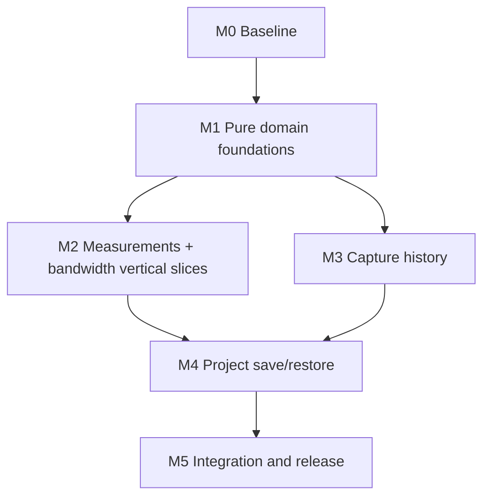

# Scope Analyzer 0.11.0 P0 Implementation Plan

## 1. Outcome

Deliver one release containing all approved P0 capabilities:

- Offline, frozen Capture, and Live share engineering measurement definitions.
- Live and `.scope` replay expose a bounded, navigable Capture event history.
- `.scopeproj` restores a complete durable workspace transactionally.
- Live configuration shows exact SCP1 payload/serial utilization and actionable suggestions.

The plan is organized as vertical milestones. Each milestone must compile, pass its targeted tests, and leave existing acquisition/recording/replay workflows usable.

## 2. Preconditions

### WP0.1 Restore a valid Git worktree

The current repository worktree’s `.git` pointer references a missing original worktree. Before product edits:

- Re-establish a valid repository root and worktree.
- Preserve all existing 0.10.0 shared-analysis changes and planning files.
- Create/switch to a `codex/` implementation branch.
- Confirm `git status`, `git diff`, and worktree ownership before editing.

**Exit:** valid Git metadata, all intended current files present, no user changes lost.

### WP0.2 Capture the 0.10.0 baseline

Run and record:

- `cargo +1.87.0 fmt --all -- --check`
- `cargo +1.87.0 check --all-targets`
- `cargo +1.87.0 clippy --all-targets --quiet`
- `cargo +1.87.0 test --no-fail-fast`
- relevant ignored performance baselines
- optimized builds for `scope_analyzer` and `scope_dsp_simulator`

Keep a baseline of test counts, Live simulator drops, and performance timings for comparison.

**Exit:** known-good baseline or a separately documented pre-existing failure list.

### WP0.3 Freeze semantic decisions

Approve [design.md](./design.md), especially frequency, P/Q/S/PF definitions, history limits, Capture assets, transactional project restore, and bandwidth thresholds.

**Exit:** no unresolved product-semantic decision that would change persisted schema or algorithm meaning.

## 3. Dependency Order

Recommended one-engineer estimate: roughly 26–38 focused engineering days, excluding review latency and Windows packaging availability. `.scopeproj` and recovery are the largest uncertainty.

## 4. Milestone M1 — Pure Domain Foundations

### WP1.1 Add the measurement library API

**Files**

- New `src/measurements.rs`
- `src/lib.rs`
- `src/data/model.rs` only if a reusable segment/window helper is justified

**Work**

- Define requests/results/quality flags described in the design.
- Keep the API independent of egui, ScopeApp, files, and worker handles.
- Accept gap-separated blocks and explicit scales/units.
- Reject non-finite configuration without panics.

**Tests**

- DTO/default validation.
- Empty/short/all-NaN/misaligned/non-monotonic input.
- Gap quality propagation.

**Exit:** library compiles with no application integration.

### WP1.2 Implement scalar statistics

**Work**

- Mean, true RMS, min/max, signed peaks, absolute peak, peak-to-peak.
- Aggregate finite samples without crossing gaps.
- Use numerically stable accumulation (`f64` sum/sum-of-squares).

**Tests**

- Constant, DC-offset sine, negative-only, square wave, sparse NaN.
- Known scale factors.
- Multiple segments equal concatenated statistics where gap timing is irrelevant.

**Exit:** analytical fixtures within documented tolerance.

### WP1.3 Implement actual-frequency estimation

**Work**

- Mean removal, adaptive hysteresis, interpolated rising crossings, median/outlier rejection.
- Per-segment estimation; choose the estimate with the most accepted periods or combine consistent segments by accepted-period count.
- Return quality diagnostics, not a fabricated zero.

**Tests**

- 45–65 Hz sine at several sample rates/phases/amplitudes.
- DC offset, harmonics, modest noise, frequency step, nonuniform timestamps.
- Low amplitude, too few cycles, missing samples, gap between crossings.

**Exit:** steady clean sine error ≤0.1%; noisy/harmonic fixtures ≤0.5%; invalid cases classified correctly.

### WP1.4 Implement three-phase P/Q/S/PF

**Work**

- Six-channel binding validation and aligned finite sample selection.
- Total P, fundamental phasor Q, effective RMS S, true PF.
- Unit normalization and sign convention.
- Invalid/partial/gap quality flags.

**Tests**

- Balanced unity PF, ±30° phase shift, leading/lagging signs.
- Unbalanced amplitude, DC offset, 5th/7th harmonics, reversed current polarity.
- Near-zero voltage/current, one missing phase, gap and scale/unit conversions.

**Exit:** clean analytical fixtures ≤1% error and documented distorted/unbalanced behavior.

### WP1.5 Add the link-budget library API

**Files**

- New `src/live/bandwidth.rs`
- `src/live/mod.rs`
- `src/lib.rs`

**Work**

- Implement exact payload/frame/throughput/latency calculations.
- Separate protocol validity from transport policy severity.
- Add deterministic suggestion search.

**Tests**

- I16/I32/F32/U8 combinations and sparse masks.
- Predicted encoded SampleBatch length equals `Message::SampleBatch(...).encode_payload()` plus frame overhead.
- Payload maximum, arithmetic overflow, zero input, and suggestion ordering.

**Exit:** pure function fully tested and no UI dependency.

### WP1.6 Define project IDs and schema DTO skeleton

**Files**

- New `src/project.rs` in the application crate, or library if future CLI reuse is immediately practical
- `src/app/state.rs`

**Work**

- Define schema envelope, IDs, path/fingerprint/channel references, and validation errors.
- Implement parsing/serialization/validation only; do not wire ScopeApp yet.
- Set 10 MiB project JSON limit and safe path rules.

**Tests**

- Minimal valid V1 document.
- Duplicate IDs, dangling refs, future schema, non-finite values, oversized file, unsafe asset paths.
- Deterministic pretty JSON round-trip.

**Exit:** V1 schema is reviewable before UI wiring.

## 5. Milestone M2 — Measurements and Bandwidth Vertical Slices

### WP2.1 Replace the narrow offline measurement result

**Files**

- `src/app.rs`
- `src/app/state.rs`
- `src/app/jobs.rs`

**Work**

- Replace/retire `AutoMeasurement`, `MeasurementCache`, and result structs with shared result types.
- Include channel scales, segments, measurement profile, power bindings, and relevant units in job keys.
- Read with `read_range_segments_cancellable` so frequency/power never cross gaps.
- Preserve cancellation, data-generation checks, and stale-result rejection.

**Tests**

- Job key invalidates on cursor range, source generation, scale, unit/profile, and power binding changes.
- Stale/cancelled result cannot overwrite current state.

**Exit:** existing Y1/Y2/dY/min/max remain correct and new statistics are available offline.

### WP2.2 Redesign the Analysis measurement panel

**Work**

- Show Y1/Y2/dY plus mean/RMS/min/max/|peak|/peak-to-peak/frequency.
- Add compact/expanded column modes for narrow windows.
- Add quality/stale/gap tooltips.
- Keep at most 12 rows per existing performance policy unless explicitly expanded.

**Native QA**

- Chinese/English, narrow/wide panel, light/dark theme, many channels, derived channel rows.

**Exit:** daily scalar measurements require no export or manual cursor-period calculation.

### WP2.3 Add three-phase power configuration and panel

**Work**

- Add voltage A/B/C and current A/B/C selectors with name-based triplet assistance.
- Add gains/unit override and sign help.
- Display P/Q/S/PF/frequency/window/quality.
- Persist settings later through project DTO; keep safe defaults in runtime state now.

**Tests**

- Selector distinctness and channel availability.
- Power worker cache invalidation.
- Missing/invalid unit warning behavior.

**Exit:** one selected dataset/Capture can produce traceable P/Q/S/PF.

### WP2.4 Add Live measurement worker state

**Files**

- `src/live/state.rs` for profile/data snapshot access only
- `src/app/state.rs`, `src/app/jobs.rs`, `src/app/live_ui.rs` for worker ownership/UI

**Work**

- Add Live measurement profile, last result, generation/key, worker/cancel token, coalesced pending request, last dispatch time.
- Build the latest 10-cycle bounded snapshot.
- Default 5 Hz refresh and never queue more than one pending newest request.
- Cancel/clear on disconnect, channel table change, or incompatible configuration.

**Tests**

- Coalescing drops obsolete requests without blocking acquisition.
- Disconnect/table change prevents stale result display.
- Frozen/trigger Capture and Live rolling window share the same engine.

**Exit:** Live measurement computation is isolated from the session and recorder threads.

### WP2.5 Add Live engineering meter UI

**Work**

- Add a Measurements inspector tab/section with configurable rows and power card.
- Show refresh age and invalid/gap state.
- “Analyze window” freezes the exact measurement window through SnapshotDataSource when deeper FFT/sequence analysis is needed.

**Native QA**

- Streaming simulator, pause, trigger capture, disconnect, reconnect, channel reconfigure.

**Exit:** Live RMS/peaks/frequency/power update without visible plot or acquisition regression.

### WP2.6 Integrate the bandwidth badge and assistant

**Files**

- `src/app/live_ui.rs`
- `src/live/state.rs`

**Work**

- Recompute on transport/baud/table/mask/rate/batch changes.
- Display payload bytes, wire rate, utilization, frame rate, latency, and severity.
- Add suggestion preview with explicit Apply.
- Recompute from actual Configure result acknowledged by the device.
- Block Critical serial budget by default; expert override is one-shot and logged in status.

**Tests**

- UI helper state for safe/warning/critical/unknown.
- Suggestion Apply changes only intended Configure fields.
- Protocol-invalid input cannot be overridden.

**Exit:** users see feasibility before Configure & Start.

### M2 Gate

- Full normal test suite passes.
- Simulator Live session shows zero new host/device drops at default settings.
- Measurements for the same frozen window match Offline and Live result objects.

## 6. Milestone M3 — Capture History and Replay Events

### WP3.1 Implement bounded CaptureHistory

**Files**

- New `src/live/capture_history.rs`
- `src/live/mod.rs`
- `src/live/state.rs`

**Work**

- Entry/payload/origin/quality models.
- Entry and byte limits, pinned-aware eviction, selection, labels/notes, clear/remove.
- Approximate-byte calculation with overflow safety.

**Tests**

- 101-entry eviction, byte-pressure eviction, pinned entries, all-pinned rejection, selection after eviction/removal.

**Exit:** history invariants hold independently of UI.

### WP3.2 Return every completed Capture from TriggerEngine

**Files**

- `src/live/trigger.rs`
- `src/live/state.rs`
- affected trigger/recording tests

**Work**

- Add `feed_all` or change `feed` to return `Vec<TriggerCapture>`.
- Preserve exact chronological order and Single semantics.
- Record and retain each Capture.

**Tests**

- Two valid Normal triggers completed in one incoming batch.
- Trigger across batch boundary, gap reset, Single only once, Auto timeout.

**Exit:** no completed event is silently discarded at the batch boundary.

### WP3.3 Migrate Live state from last_capture to selected history entry

**Work**

- Replace direct `last_capture` reads with selected-entry accessors.
- Rearm clears trigger working state, not retained history.
- Trigger capture still takes display precedence when selected.
- Analyze selected Capture through existing SnapshotDataSource.

**Tests**

- Existing display/rearm tests updated.
- Selection remains valid after eviction/deletion.
- Acquisition/recording continues when retention rejects a Capture.

**Exit:** existing single-Capture behavior remains intuitive while history is retained.

### WP3.4 Add Capture/event UI

**Files**

- `src/app/live_ui.rs`
- `src/app/state.rs` only for presentation state

**Work**

- Event list with time, trigger summary, auto/gap/quality, label, pin, note.
- Previous/next, select, analyze, remove, clear, keep-selection toggle.
- Virtualized/scrollable rendering for 100 entries.

**Native QA**

- Rapid simulator triggers, pinned eviction, bilingual labels, keyboard navigation.

**Exit:** multiple events are inspectable without stopping Live acquisition.

### WP3.5 Adapt `.scope` trigger records to lazy history entries

**Files**

- `src/live/recording.rs`
- `src/live/scope_source.rs`
- `src/app/live_ui.rs` or offline event panel

**Work**

- Map TriggerRecord sample indices/pre/post to time ranges.
- Detect incomplete pre/post and gaps.
- Read event samples lazily from ScopeRecordingDataSource.
- Expose recording-event panel when a `.scope` source is active.

**Tests**

- Multiple triggers, triggers near beginning/end, gap within Capture, recovered tail, reordered wire channels.

**Exit:** `.scope` event navigation uses existing format and source pipeline.

### WP3.6 Add Capture-to-`.scope` companion writer helper

**Files**

- `src/live/recording.rs` or new `src/live/capture_asset.rs`

**Work**

- Convert TriggerCapture plus table/presentation/config to valid `.scope` V1.
- Split F32 SampleBatch records at max batch/payload limits.
- Preserve timestamps/sample indices and write one trigger record.
- Atomic file creation; do not leave a valid-looking partial asset.

**Tests**

- Write/open/replay round-trip, >4096 samples, multiple channels, trigger position, timestamp, presentation, interruption cleanup.

**Exit:** project persistence can reuse normal `.scope` integrity/replay code.

### M3 Gate

- Existing trigger, recording, recovery, session, and Live analysis tests pass.
- Capture memory remains within configured bounds under accelerated simulator load.

## 7. Milestone M4 — Complete Project Save, Restore, and Recovery

### WP4.1 Finalize schema V1 and validation

**Files**

- `src/project.rs`
- format documentation under `docs/formats/`

**Work**

- Add all P0 project DTO fields.
- Define defaults/migrations for schema V1.
- Validate IDs, refs, bounds, finite fields, enums, paths, annotation coordinates, and capture assets.

**Exit:** schema review frozen before wiring Save.

### WP4.2 Add source fingerprint and channel resolver

**Work**

- Relative/absolute paths, size/mtime, optional first/last 64 KiB CRC32C.
- Name/ID/index channel resolution with structured warnings.
- Directory-based batch relocation helper.

**Tests**

- Moved project directory, renamed source, duplicate channel names, reordered channels, mismatched fingerprint, missing optional/primary source.

**Exit:** source identity failures are explicit and recoverable.

### WP4.3 Build ScopeApp → ProjectDocument conversion

**Work**

- Serialize only durable state: source refs/order, presentation, layouts/viewports, analysis/profile/power bindings, formulas, Live presets, captures, export presets/annotations.
- Convert runtime indexes to ProjectChannelRef.
- Normalize annotations.
- Exclude workers/caches/textures/open sessions/undo stacks/transient status.

**Tests**

- Snapshot fixture includes every durable field.
- Changing transient state does not dirty/change serialized document.

**Exit:** project preview can be generated without writing files.

### WP4.4 Implement atomic Save and Save As

**Work**

- Materialize missing Capture assets first.
- Write temp JSON, sync, atomically replace.
- Update project path/generation only after success.
- Preserve previous project and assets on failure.

**Tests**

- Injected asset/JSON/rename failures.
- Save As relative path recalculation.
- Repeated save does not rewrite unchanged content-addressed assets.

**Exit:** failed save never corrupts last good project.

### WP4.5 Implement staged project loading

**Work**

- Parse/validate/resolve/open/build `RestoredWorkspace` in a cancellable worker.
- Keep current workspace active during staging.
- Apply atomically after all required sources succeed.
- Map all selected channels and Capture refs; retain warnings.

**Tests**

- Successful full round-trip.
- Bad primary leaves current state byte-for-byte/durably unchanged.
- Missing imported dataset restored disabled with warning when user chooses partial open.
- Cancel leaves current workspace unchanged.

**Exit:** no partially restored workspace is observable.

### WP4.6 Add project menus, dirty state, and close/open prompts

**Work**

- New/Open/Save/Save As/Recent Projects.
- Window/title dirty indicator.
- Prompt before New/Open/exit when dirty.
- Keep existing config import/export as presets.

**Tests**

- Dirty generation changes for durable mutations only.
- Save prompt decision helpers.

**Exit:** project lifecycle is discoverable and safe.

### WP4.7 Persist and restore annotations/export state

**Work**

- Add normalized annotation DTO conversions.
- Restore label text/anchors, text/arrows/shapes/ink, export selection presets and batch windows.
- Do not restore undo/redo history.

**Tests**

- Different preview sizes/DPI, coordinate clamp, Chinese text, deleted channels, missing curve anchors.

**Exit:** saved evidence workspace visually reopens within coordinate tolerance.

### WP4.8 Integrate Capture assets and history refs

**Work**

- Existing `.scope` events reference original source/ordinal.
- In-memory Captures reference companion assets.
- Background materialization after project is saved.
- Relocate recovery assets on Save As and garbage-collect only unreferenced project-owned assets after confirmation.

**Tests**

- Project with mixed recording-backed and in-memory Captures.
- Missing asset warning, moved assets directory, duplicate Save As, recovered-tail asset rejection.

**Exit:** selected/pinned/history entries required by the saved project survive restart.

### WP4.9 Add autosave and crash recovery

**Work**

- Generation/debounce/rate-limit rules.
- Saved-project and untitled recovery paths.
- Startup discovery and recovery prompt.
- Cleanup after explicit save/discard.

**Tests**

- Newer/older autosave, invalid autosave, interrupted temp write, recovery then Save As, clean shutdown.

**Exit:** recovery cannot replace a newer explicit save or load invalid state silently.

### M4 Gate

One end-to-end test must:

1. Open primary + imported data.
2. Configure panes, scales, cursors, power bindings, derived curve, Live preset, and annotations.
3. Add both recording-backed and in-memory Captures.
4. Save project.
5. Construct a new ScopeApp state and load the project.
6. Assert restored durable state and rerun measurement/export entrypoints.

## 8. Milestone M5 — Integration, Compatibility, and Release

### WP5.1 Cross-feature regression suite

Required scenarios:

- Live simulator → engineering meters → multiple triggers → analyze selected Capture → save project → restart → reopen Capture → same measurements.
- `.scope` with multiple triggers/gaps → event navigation → project save/load.
- Critical serial budget blocks Start until configuration changes or one-shot expert override.
- Missing imported file during project load does not damage the active workspace.
- Legacy configs and legacy `.scope` remain readable.

### WP5.2 Performance and resource gates

- Measurement worker p95 duration must remain below its refresh interval on representative maximum Live window.
- Accelerated simulator shows no additional acquisition/recording drops caused by analysis.
- CaptureHistory never exceeds configured in-memory byte/entry bounds.
- Project JSON save excludes raw samples and stays bounded; Capture asset writes are asynchronous/cancellable.
- Project load of representative multi-dataset workspace meets a documented baseline and remains cancellable.

Run existing ignored Cloud/CSV/DAT/PNG baselines to detect unrelated regressions.

### WP5.3 Native workflow QA

Windows-first QA matrix:

- TCP and serial connection/configuration assistant.
- Live meters under connect/start/pause/trigger/rearm/stop/disconnect/reconnect.
- Capture event list and memory pressure.
- Project New/Open/Save/Save As/recent/dirty/close prompts.
- Missing/moved source relocation.
- Autosave recovery after forced termination.
- Chinese/English, light/dark, narrow window, software renderer.

### WP5.4 Version and documentation

Because 0.11.0 changes user-facing behavior and adds a public project format, synchronize:

- `Cargo.toml`
- `Cargo.lock`
- `scripts/package-windows.ps1`
- `scripts/ScopeAnalyzer.wxs`
- README artifact names
- release synchronization test

Documentation:

- README 0.11.0 summary and workflows.
- `.scopeproj` V1 schema/compatibility document.
- Measurement definition document with P/Q/S/PF sign/unit examples.
- Capture history/asset behavior.
- Bandwidth formula and warning policy.
- In-app Help updates.

### WP5.5 Release gates

Portable gates:

- fmt
- all-target check
- standard clippy
- full non-ignored tests
- relevant ignored performance tests
- optimized dual-binary build
- `git diff --check`
- version-sync test

Windows release host:

- `scripts/release-check.ps1`
- offline packaging with preloaded Mesa/ANGLE
- installer smoke test and project-file association decision

## 9. Test Matrix

| Area | Unit | Integration | Native/Manual | Compatibility |
|---|---|---|---|---|
| Scalar measurements | analytical signals, invalid/gap | DataSource cursor range | table/layout/quality | existing Y1/Y2/min/max |
| Frequency | clean/noisy/harmonic/gap | Offline vs frozen vs Live | stale/invalid display | cursor 1/dX retained separately |
| P/Q/S/PF | balanced/unbalanced/distorted | six-channel source and Capture | bindings/units/sign help | existing pseq formulas unchanged |
| Bandwidth | encoder-length equality, suggestions | Configure actual-value reconciliation | Safe/Warning/Critical UI | SCP1 V1 unchanged |
| Capture history | limits/eviction/selection | trigger→record→replay | navigation/pin/note/analyze | single-Capture behavior preserved |
| Project schema | parse/validate/migrate | full round-trip/partial/cancel | menus/dirty/relocation | split configs and `.scope` V1 |
| Autosave | age/atomicity/invalid | crash-recovery fixture | startup prompt | explicit save never overwritten |
| Capture assets | write/open/trigger round-trip | project mixed origins | size estimate/missing asset | ordinary `.scope` V1 reader |

## 10. Risk Register

| Risk | Impact | Mitigation | Release Gate |
|---|---|---|---|
| Power definitions interpreted differently by users | Wrong engineering decisions | Explicit definitions, sign/unit help, analytical fixtures, review by domain user | Design approval + measurement doc |
| Live analysis steals acquisition CPU | Drops or recorder gaps | coalescing worker, bounded windows, cadence control, performance counters | accelerated simulator soak |
| Capture history memory growth | process instability | dual bounds, pinned-aware rejection, lazy recording entries | memory-bound tests |
| Project load partially mutates state | data/work loss | staged RestoredWorkspace and atomic commit | injected-failure tests |
| Autosave corrupts explicit project | recovery loss | separate atomic autosave, generation checks | forced-termination suite |
| Capture assets orphan or disappear | incomplete project | stable relative paths, fingerprints, missing-asset warnings, conservative cleanup | Save As/move tests |
| Schema freezes runtime implementation details | future migration burden | explicit DTOs, IDs, conversion layers | schema review before wiring |
| Existing worktree Git metadata is invalid | cannot review or release safely | WP0.1 is a hard prerequisite | no coding before valid status/diff |

## 11. Definition of Done for 0.11.0

0.11.0 is complete only when:

- All four P0 epics are user-visible and documented.
- Offline, frozen Capture, and Live produce consistent measurements for the same samples.
- P/Q/S/PF definitions and units are explicit and verified.
- More than one Live and recording-backed Capture can be retained, navigated, analyzed, and restored.
- A saved `.scopeproj` restores all declared durable state or reports precise unresolved items without partial mutation.
- Autosave recovery is safe and tested.
- Bandwidth predictions match encoded SCP1 sizes and protect serial users from unsafe configurations.
- SCP1 V1 and `.scope` V1 compatibility tests pass.
- Existing import, plotting, FFT/THD, sequence, PLL/dq0, derived, export, recording, simulator, and VS Code bridge tests remain green.
- Required version sync, release preflight, performance baselines, and Windows packaging pass.

## 12. Recommended Review Checkpoints

1. **Design review:** approve `design.md` semantics before product code.
2. **M1 API review:** measurement/bandwidth/schema types before UI integration.
3. **M2 domain-result review:** validate measurement numbers with real power-electronics samples.
4. **M3 workflow review:** validate Capture history behavior under rapid triggers.
5. **M4 data-safety review:** adversarial project save/load/autosave testing.
6. **Release review:** complete Windows native workflow and packaging evidence.
